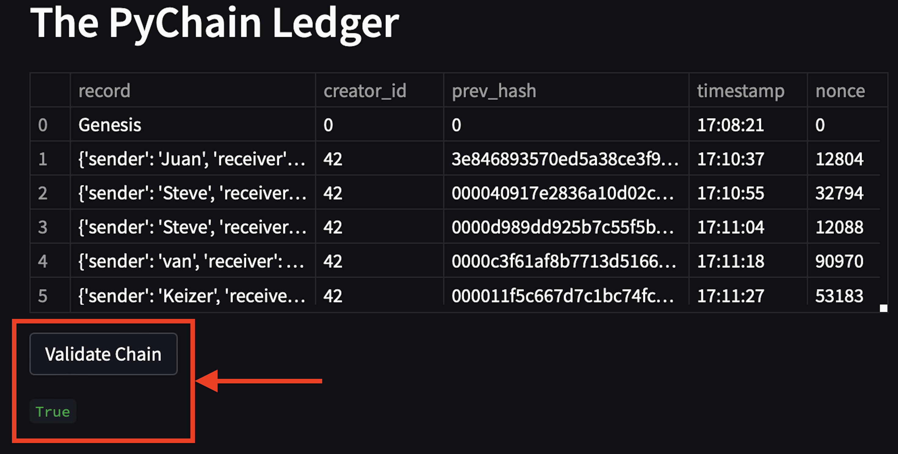
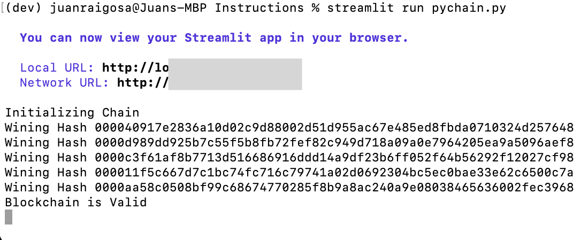

# The PyChain Ledger

This blockchain-based ledger allows different entities to conduct financial transactions to transfer a virtual asset like digital money between senders and receivers, and to verify the integrity of the data in the ledger.
It is runned using the Streamlit web interface.
 

 

The PyChain ledger creates blocks with the "Add Block" button  that contains a record with the information of the sender, receiver and the amount that has been transfered.

 

 

For each block, it is also stored in the ledger the following information: 
- Creator id 
- Previous hash
- Timestamp 
- Nonce

 

 

Theres is also a validation button to verify that every block hash is equal to the previous hash in all the blockchain. When it is valid, it returns a True statement.

 

 

The application includes a slider bar to set the grade of difficulty between 1 and 5 zeros to the left of the hash to calculate the winning hash required to mine each block.

 

 

 

The block inspector allows the user to select from a drop dowm menu, any of the blocks that has been created in the blockchain, and it displays the information included in each of them. 

 

